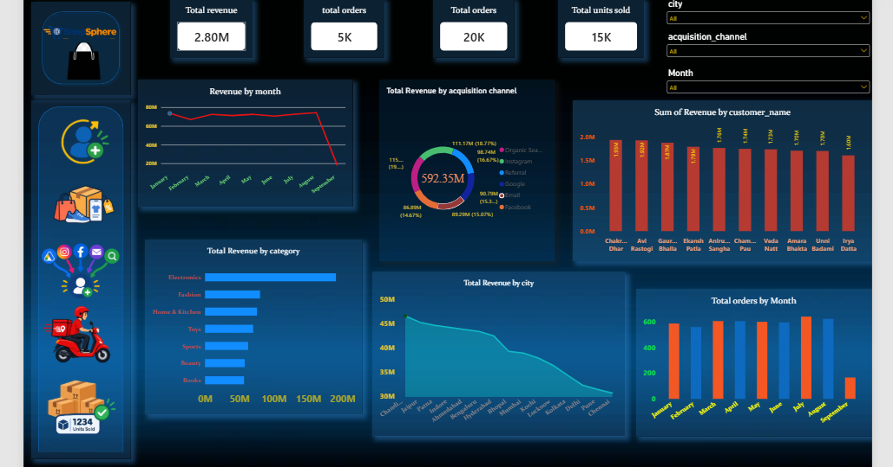

# 🛍️ ShopSphere — Business Overview Dashboard

> **A high-level view of ShopSphere's revenue, orders, units sold, customer performance, product categories, cities, and acquisition channels through interactive Power BI analytics.**

## 📌 Overview

The **Business Overview Dashboard** is the main executive dashboard of the **ShopSphere E-Commerce Analytics Project**.

It provides a consolidated view of overall business performance and helps users quickly understand revenue trends, order activity, customer contribution, product-category performance, geographic performance, and acquisition-channel revenue.

The dashboard is designed to provide an executive-level snapshot of the business while allowing users to filter the analysis by **city, acquisition channel, and month**.

---

## 🎯 Dashboard Objective

The main objective of this dashboard is to provide a single view of ShopSphere's overall business performance.

It helps answer questions such as:

- What is the total revenue generated?
- How many orders have been placed?
- How many units have been sold?
- How does revenue change month by month?
- Which acquisition channels generate the most revenue?
- Which product categories contribute the most revenue?
- Which cities generate the highest revenue?
- Which customers contribute the highest revenue?
- How does order volume change across months?

---

## 📊 Key Performance Indicators

| KPI | Value |
|---|---:|
| 💰 Total Revenue | 2.80M |
| 🛒 Total Orders | 5K |
| 👥 Customer Base | 20K |
| 📦 Total Units Sold | 15K |

> KPI values represent the values displayed in the Power BI dashboard.

---

## 📈 Dashboard Visualizations

### 1. Revenue by Month

A monthly revenue trend showing how ShopSphere's revenue changes over time.

This visualization helps identify:

- Monthly revenue trends
- High-performing months
- Changes in sales performance
- Potential seasonal patterns

---

### 2. Total Revenue by Acquisition Channel

A breakdown of total revenue generated through different customer acquisition channels.

The dashboard analyzes channels including:

- Organic Search
- Instagram
- Referral
- Google
- Email
- Facebook

This helps evaluate the revenue contribution associated with different acquisition sources.

---

### 3. Revenue by Customer

A comparison of revenue generated by individual customers.

This visualization helps identify high-value customers and understand how much revenue the top customers contribute to the overall business.

It can support:

- Customer retention
- Loyalty programs
- Personalized offers
- High-value customer targeting

---

### 4. Total Revenue by Category

A comparison of revenue across major product categories.

Categories displayed in the dashboard include:

- Electronics
- Fashion
- Home & Kitchen
- Toys
- Sports
- Beauty
- Books

This helps identify the product categories that contribute most strongly to overall revenue.

---

### 5. Total Revenue by City

A geographic comparison of revenue generated across different cities.

This analysis helps identify:

- High-revenue cities
- Lower-performing markets
- Geographic sales concentration
- Opportunities for regional marketing

---

### 6. Total Orders by Month

A monthly comparison of order volume.

This visualization helps analyze:

- Monthly order activity
- High-order months
- Changes in demand
- Relationship between order volume and revenue

---

## 🎛️ Interactive Filters

The dashboard includes interactive filters that allow users to dynamically analyze business performance.

### Available Filters

- 📍 City
- 📢 Acquisition Channel
- 📅 Month

Users can combine these filters to analyze revenue and order performance for specific locations, acquisition sources, or time periods.

---

## 🔍 Key Business Insights

### 💰 Overall Revenue

The dashboard reports total revenue of **2.80M**, providing a high-level view of ShopSphere's overall sales performance.

### 📈 Revenue Trends

Monthly revenue analysis helps identify changes in business performance over time and highlights months with stronger or weaker revenue.

### 📢 Acquisition Channel Performance

Revenue is distributed across multiple acquisition channels, allowing ShopSphere to compare the contribution of different customer acquisition sources.

### 🛍️ Category Performance

The category analysis shows that revenue contribution differs significantly between product categories, helping identify important revenue-driving categories.

### 🌍 Geographic Performance

Revenue varies across cities, providing insights into geographic markets where ShopSphere has stronger sales performance.

### 👥 Customer Contribution

The customer-level revenue analysis highlights high-value customers who contribute significantly to total business revenue.

---

## 💡 Business Questions Answered

This dashboard helps answer:

1. What is ShopSphere's total revenue?
2. How many orders have been placed?
3. How many units have been sold?
4. What is the overall customer base?
5. How does revenue change by month?
6. Which acquisition channels generate the most revenue?
7. Which product categories generate the most revenue?
8. Which cities generate the highest revenue?
9. Which customers generate the most revenue?
10. How does order volume change across months?
11. How does business performance change when different filters are applied?

---

## 🧮 Analytics & DAX

The dashboard uses Power BI measures and analytical calculations for metrics such as:

- Total Revenue
- Total Orders
- Total Units Sold
- Customer Count
- Revenue by Month
- Revenue by Acquisition Channel
- Revenue by Category
- Revenue by City
- Revenue by Customer
- Orders by Month

These calculations combine customer, order, product, and acquisition-channel information to provide a consolidated view of ShopSphere's business performance.

---

## 🛠️ Tools & Technologies

- **Power BI** — Dashboard development and visualization
- **DAX** — Measures and analytical calculations
- **Excel** — Data preparation and analysis
- **MySQL** — Data storage and querying
- **Python** — Data generation and preprocessing

---

## 🎨 Dashboard Design

The Business Overview Dashboard uses a dark blue, cyan, and yellow visual theme aligned with the ShopSphere brand.

### Design Elements

- Executive KPI cards
- Interactive slicers
- Revenue trend analysis
- Category performance analysis
- City-level revenue analysis
- Acquisition-channel analysis
- Customer-level revenue analysis
- Monthly order analysis
- ShopSphere branding and visual icons

The layout is designed to provide a quick executive overview while allowing users to explore different business dimensions.

---

## 📌 Business Value

The Business Overview Dashboard provides ShopSphere with a centralized view of business performance.

It can support decisions related to:

- Revenue growth
- Product category strategy
- Geographic expansion
- Customer management
- Marketing channel allocation
- Sales performance monitoring
- Demand analysis

By combining multiple business dimensions into one dashboard, decision-makers can quickly identify important trends and areas requiring attention.

---

## 🚀 Future Enhancements

Possible future improvements include:

- Profit and profit-margin analysis
- Year-over-year revenue growth
- Monthly and quarterly growth rates
- Customer Lifetime Value (CLV)
- Customer segmentation
- Sales forecasting
- Product profitability analysis
- Regional growth analysis
- Marketing ROI
- New vs. returning customer analysis
- Predictive sales analytics

---

## 📸 Dashboard Preview

---

## 📁 ShopSphere Dashboard Suite

This dashboard is part of the complete **ShopSphere E-Commerce Analytics Dashboard Suite**.

- [Customer & Sales](../Customer_Sales/)
- [Product Performance](../Product_Performance/)
- [Marketing & Campaign Performance](../Marketing_Campaign_Performance/)
- [Delivery Performance](../Delivery_Performance/)

---

## 👨‍💻 Project

**ShopSphere — End-to-End E-Commerce Analytics**

Built using:

**Python → MySQL → Excel → Power BI**

The project demonstrates an end-to-end analytics workflow from data generation and storage to business intelligence, visualization, and business decision-making.
