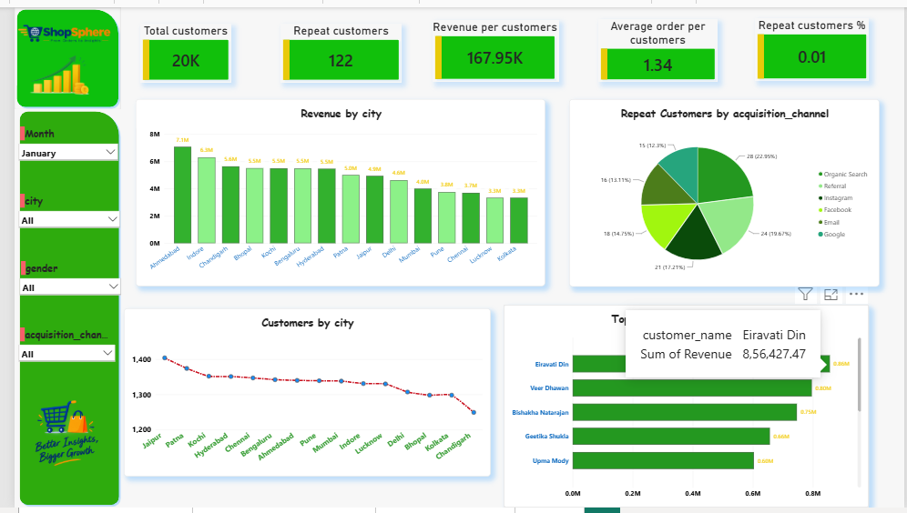

# 👥 ShopSphere — Customers & Sales Dashboard

> **Understanding customer behavior, revenue distribution, repeat purchases, and customer-level sales performance through interactive Power BI analytics.**

## 📌 Overview

The **Customers & Sales Dashboard** is an interactive Power BI dashboard developed as part of the **ShopSphere E-Commerce Analytics Project**.

The dashboard focuses on understanding customer behavior and sales performance across different cities, acquisition channels, and customer segments.

It helps analyze customer acquisition, repeat purchasing behavior, revenue contribution, and customer-level sales performance through interactive KPIs, charts, and filters.

---

## 🎯 Dashboard Objective

The main objective of this dashboard is to answer important customer and sales questions such as:

- How many customers does ShopSphere have?
- How many customers are repeat customers?
- How much revenue is generated per customer?
- What is the average number of orders per customer?
- What percentage of customers are repeat customers?
- Which cities generate the highest revenue?
- Which cities have the highest customer count?
- Which acquisition channels generate the most repeat customers?
- Which customers contribute the highest revenue?

---

## 📊 Key Performance Indicators

| KPI | Value |
|---|---:|
| 👥 Total Customers | 20K |
| 🔁 Repeat Customers | 122 |
| 💰 Revenue per Customer | 167.95K |
| 🛒 Average Order per Customer | 1.34 |
| 🔄 Repeat Customers % | 0.01 |

> KPI values represent the values displayed in the Power BI dashboard.

---

## 📈 Dashboard Visualizations

### 1. Revenue by City

A city-level revenue comparison showing how much revenue is generated across different locations.

This visualization helps identify:

- Highest revenue-generating cities
- Lower-performing cities
- Geographic differences in sales performance
- Potential locations for targeted marketing and business expansion

---

### 2. Repeat Customers by Acquisition Channel

A visual breakdown of repeat customers across different acquisition channels.

The dashboard analyzes channels including:

- Organic Search
- Referral
- Instagram
- Facebook
- Email
- Google

This helps evaluate which customer acquisition sources are associated with stronger repeat-customer activity.

---

### 3. Customers by City

A city-level comparison of the customer base.

This visualization helps understand:

- Customer distribution across cities
- Cities with larger customer populations
- Geographic customer concentration
- Potential markets for customer retention campaigns

---

### 4. Top Customers by Revenue

A ranking of customers based on their total revenue contribution.

The dashboard highlights the highest-revenue customers and helps identify valuable customers who contribute significantly to overall sales.

This can support:

- Customer retention strategies
- Loyalty programs
- Personalized offers
- High-value customer segmentation

---

## 🎛️ Interactive Filters

The dashboard includes interactive filters that allow users to analyze customer and sales performance dynamically.

### Available Filters

- 📅 Month
- 📍 City
- 👤 Gender
- 📢 Acquisition Channel

These filters allow users to drill down into specific customer segments and understand how sales performance changes across different dimensions.

---

## 🔍 Key Business Insights

Based on the dashboard analysis:

### 🌍 Geographic Revenue Performance

Revenue varies significantly across cities, allowing ShopSphere to identify high-performing locations and cities that may require additional business attention.

### 🔁 Repeat Customer Behavior

The dashboard tracks repeat customers and their contribution across acquisition channels, helping evaluate customer retention performance.

### 📢 Acquisition Channel Performance

Repeat-customer distribution across acquisition channels provides insights into which channels are associated with returning customers.

### 👥 Customer Distribution

Customer counts vary across cities, helping identify areas with larger customer bases and potential opportunities for regional campaigns.

### 💰 High-Value Customers

The Top Customers by Revenue visual helps identify customers contributing significant revenue, making them potential targets for retention and loyalty initiatives.

---

## 💡 Business Questions Answered

This dashboard helps answer:

1. What is the total customer base?
2. How many customers are repeat customers?
3. What is the revenue generated per customer?
4. What is the average number of orders per customer?
5. What percentage of customers are repeat customers?
6. Which cities generate the most revenue?
7. How are customers distributed across cities?
8. Which acquisition channels generate repeat customers?
9. Who are the highest-revenue customers?
10. How can customer data be used to improve retention and sales?

---

## 🧮 Analytics & DAX

The dashboard uses Power BI measures and customer-level analytics to calculate metrics such as:

- Total Customers
- Repeat Customers
- Revenue per Customer
- Average Orders per Customer
- Repeat Customer %
- Total Revenue
- Revenue by City
- Customer Count by City
- Repeat Customers by Acquisition Channel
- Customer Revenue Ranking

These calculations combine customer, order, revenue, and acquisition-channel data to provide an integrated view of customer and sales performance.

---

## 🛠️ Tools & Technologies

- **Power BI** — Dashboard development and visualization
- **DAX** — Measures and analytical calculations
- **Excel** — Data preparation and analysis
- **MySQL** — Data storage and querying
- **Python** — Data generation and preprocessing

---

## 🎨 Dashboard Design

The dashboard follows the visual identity of the **ShopSphere E-Commerce Analytics Project**.

### Design Elements

- Green and yellow ShopSphere theme
- KPI cards for important business metrics
- Interactive slicers
- City-level analysis
- Customer-level revenue analysis
- Acquisition-channel analysis
- Clean and interactive Power BI layout

The design is focused on making important customer and sales insights easy to identify.

---

## 📌 Business Value

The Customers & Sales Dashboard helps ShopSphere understand:

- Customer acquisition and distribution
- Customer retention
- Repeat purchasing behavior
- Revenue contribution
- Geographic sales performance
- High-value customers
- Acquisition-channel effectiveness

These insights can support better **customer retention, targeted marketing, regional strategy, and revenue-growth decisions**.

---

## 🚀 Future Enhancements

Possible future improvements include:

- Customer Lifetime Value (CLV)
- Customer segmentation
- RFM analysis
- Customer cohort analysis
- Monthly customer growth
- Customer churn analysis
- Revenue contribution by customer segment
- Repeat purchase trends over time
- New vs. returning customer analysis
- Predictive customer retention analysis

---

## 📸 Dashboard Preview

---

## 📁 ShopSphere Dashboard Suite

This dashboard is part of the complete **ShopSphere E-Commerce Analytics Dashboard Suite**.

- [Business Overview](../Business_Overview/)
- [Product Performance](../Product_Performance/)
- [Marketing & Campaign Performance](../Marketing_Campaign_Performance/)
- [Delivery Performance](../Delivery_Performance/)

---

## 👨‍💻 Project

**ShopSphere — End-to-End E-Commerce Analytics**

Built using:

**Python → MySQL → Excel → Power BI**

The project demonstrates an end-to-end analytics workflow from data generation and storage to business intelligence, visualization, and decision-making.
