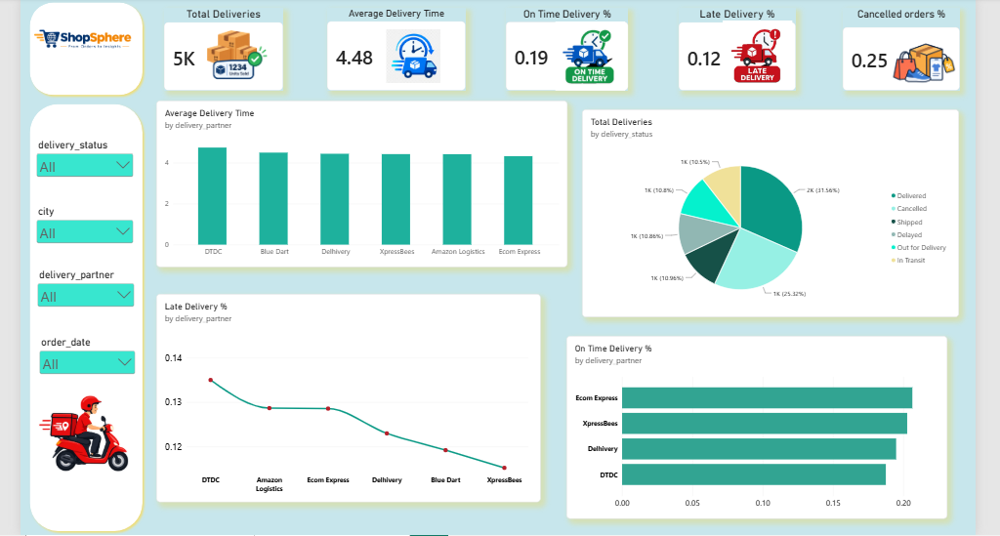

# 🚚 ShopSphere — Delivery Performance Dashboard

> **Monitoring delivery operations, delivery time, on-time performance, late deliveries, cancellations, and logistics partner performance through interactive Power BI analytics.**

## 📌 Overview

The **Delivery Performance Dashboard** is an interactive Power BI dashboard developed as part of the **ShopSphere E-Commerce Analytics Project**.

The dashboard focuses on delivery operations and logistics performance, helping analyze delivery times, delivery status, on-time performance, late deliveries, cancelled orders, and the performance of different delivery partners.

It provides a centralized view of the delivery process and helps identify operational areas that may require improvement.

---

## 🎯 Dashboard Objective

The main objective of this dashboard is to monitor and evaluate ShopSphere's delivery performance.

It helps answer questions such as:

- How many deliveries are being handled?
- What is the average delivery time?
- What percentage of deliveries are completed on time?
- What percentage of deliveries are late?
- What percentage of orders are cancelled?
- Which delivery partners have better delivery performance?
- Which delivery partners have higher late-delivery percentages?
- What is the current distribution of delivery statuses?
- How does delivery performance vary across cities and dates?

---

## 📊 Key Performance Indicators

| KPI | Value |
|---|---:|
| 🚚 Total Deliveries | 5K |
| ⏱️ Average Delivery Time | 4.48 |
| ✅ On-Time Delivery % | 0.19 |
| ⚠️ Late Delivery % | 0.12 |
| ❌ Cancelled Orders % | 0.25 |

> KPI values represent the values displayed in the Power BI dashboard.

---

## 📈 Dashboard Visualizations

### 1. Average Delivery Time by Delivery Partner

This visualization compares the average delivery time across different logistics partners.

Delivery partners analyzed include:

- DTDC
- Blue Dart
- Delhivery
- XpressBees
- Amazon Logistics
- Ecom Express

This helps identify differences in delivery speed across logistics partners.

---

### 2. Total Deliveries by Delivery Status

A breakdown of total deliveries according to their current delivery status.

The dashboard tracks statuses including:

- Delivered
- Cancelled
- Shipped
- Delayed
- Out for Delivery
- In Transit

This provides an overview of the current delivery pipeline and helps identify orders that may require operational attention.

---

### 3. Late Delivery % by Delivery Partner

This visualization compares late-delivery percentages across logistics partners.

It helps identify delivery partners with relatively higher or lower late-delivery rates and can support logistics performance evaluation.

---

### 4. On-Time Delivery % by Delivery Partner

A comparison of on-time delivery performance across logistics partners.

The dashboard compares:

- Ecom Express
- XpressBees
- Delhivery
- DTDC

This helps identify delivery partners associated with stronger on-time delivery performance.

---

## 🎛️ Interactive Filters

The dashboard includes interactive filters that allow users to analyze delivery performance dynamically.

### Available Filters

- 📦 Delivery Status
- 📍 City
- 🚚 Delivery Partner
- 📅 Order Date

These filters allow users to investigate delivery performance for specific cities, logistics partners, delivery statuses, and time periods.

---

## 🔍 Key Business Insights

### 🚚 Delivery Volume

The dashboard tracks approximately **5K total deliveries**, providing an overall view of ShopSphere's delivery workload.

### ⏱️ Delivery Speed

The overall average delivery time displayed on the dashboard is **4.48**, providing a baseline for evaluating logistics performance.

### ✅ On-Time Performance

The dashboard tracks on-time delivery performance across delivery partners, allowing ShopSphere to identify stronger-performing logistics providers.

### ⚠️ Late Deliveries

Late-delivery percentages vary across delivery partners. Monitoring these differences can help identify logistics partners that may require operational improvement.

### ❌ Order Cancellations

The dashboard tracks cancelled orders as a percentage of overall delivery activity, helping identify potential issues in the order-to-delivery process.

### 📦 Delivery Status

The delivery-status breakdown provides visibility into orders that are delivered, shipped, delayed, cancelled, out for delivery, or currently in transit.

---

## 💡 Business Questions Answered

This dashboard helps answer:

1. How many deliveries does ShopSphere have?
2. What is the average delivery time?
3. What percentage of deliveries are on time?
4. What percentage of deliveries are late?
5. What percentage of orders are cancelled?
6. Which delivery partner has the best on-time delivery performance?
7. Which delivery partner has the highest late-delivery percentage?
8. How does average delivery time vary across delivery partners?
9. What is the current distribution of delivery statuses?
10. How does delivery performance change across cities?
11. How does delivery performance change over different order dates?

---

## 🧮 Analytics & DAX

The dashboard uses Power BI measures and analytical calculations for metrics such as:

- Total Deliveries
- Average Delivery Time
- On-Time Delivery %
- Late Delivery %
- Cancelled Orders %
- Deliveries by Status
- Average Delivery Time by Partner
- Late Delivery % by Partner
- On-Time Delivery % by Partner

These calculations combine order and delivery information to provide an integrated view of ShopSphere's logistics performance.

---

## 🛠️ Tools & Technologies

- **Power BI** — Dashboard development and visualization
- **DAX** — Measures and analytical calculations
- **Excel** — Data preparation and analysis
- **MySQL** — Data storage and querying
- **Python** — Data generation and preprocessing

---

## 🎨 Dashboard Design

The Delivery Performance Dashboard uses a light blue, white, and teal visual theme with ShopSphere branding.

### Design Elements

- KPI cards for delivery metrics
- Interactive slicers
- Delivery partner comparisons
- Delivery status analysis
- On-time delivery analysis
- Late-delivery analysis
- Average delivery-time analysis
- ShopSphere logistics icons

The layout is designed to make important operational metrics easy to monitor and compare.

---

## 📌 Business Value

The Delivery Performance Dashboard helps ShopSphere monitor the efficiency of its logistics operations.

It can support decisions related to:

- Delivery partner evaluation
- Logistics optimization
- On-time delivery improvement
- Late-delivery reduction
- Cancellation monitoring
- Customer experience improvement
- Operational performance monitoring

By comparing delivery partners and delivery statuses, ShopSphere can identify potential operational bottlenecks and opportunities for improving the delivery process.

---

## 🚀 Future Enhancements

Possible future improvements include:

- Delivery cost analysis
- Delivery SLA monitoring
- Average delivery time by city
- Customer delivery experience analysis
- Delivery partner ranking
- Monthly delivery performance trends
- Failed delivery analysis
- Return-to-origin analysis
- Delivery cost per order
- Predictive late-delivery analysis
- Logistics partner scorecard
- Customer satisfaction vs. delivery performance

---

## 📸 Dashboard Preview

---

## 📁 ShopSphere Dashboard Suite

This dashboard is part of the complete **ShopSphere E-Commerce Analytics Dashboard Suite**.

- [Business Overview](../Business_Overview/)
- [Customer & Sales](../Customer_Sales/)
- [Product Performance](../Product_Performance/)
- [Marketing & Campaign Performance](../Marketing_Campaign_Performance/)

---

## 👨‍💻 Project

**ShopSphere — End-to-End E-Commerce Analytics**

Built using:

**Python → MySQL → Excel → Power BI**

The project demonstrates an end-to-end analytics workflow from data generation and storage to business intelligence, visualization, and business decision-making.
